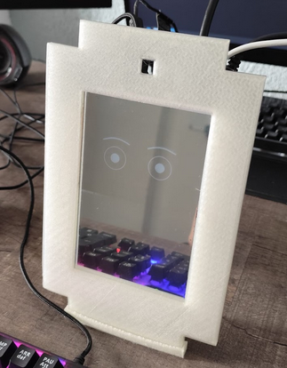

[Version anglaise](README_EN.md)

# AICompagnon

<div align="center">
  
</div>

## Objectif du projet

AICompagnon est un agent conversationnel émotionnel autonome conçu comme compagnon quotidien. Destiné aux personnes se sentant seules, isolées ou en manque d'affection, il aide à gérer les émotions.

**ATTENTION** : Ceci est un prototype conceptuel montrant les avancées technologiques. Il ne répondra pas parfaitement à toutes les attentes.

> ℹ️ Actuellement disponible uniquement en français  
> 📝 Projet réalisé dans le cadre d'un stage universitaire  
> 🔖 Version du code du stage disponible dans les [Releases](https://github.com/Juste-Leo2/AICompagnon/releases)

---

## Installation

### Prérequis matériels
- Stockage : 32Go (recommandé)
- RAM : 8Go minimum (16Go recommandé)
- Processeur et carte graphique récents

### Clonage du dépôt
```bash
git clone https://github.com/Juste-Leo2/AICompagnon.git
```
### Windows
1. Installer [Python 3.11](https://www.python.org/downloads/release/python-3119/) (cocher "Add to PATH")
2. Installer [Vulkan SDK](https://vulkan.lunarg.com/sdk/home)
3. Exécuter dans le dossier du projet :

```bash
download.bat  
run_win.bat
```
### Linux (Radxa Rock 5B+)
Système recommandé : [Radxa OS](https://docs.radxa.com/en/rock5/rock5b/download)  
`Mot de passe initial : radxa`

#### Activation SPI (si vous avez l'écran ILI9488)

```bash
sudo rsetup 
``` 
Naviguer dans l'interface et activer SPI0 CS0 

```bash
sudo reboot
``` 
Configuration broches :

```bash
Alimentation : 3.3V
CLK : GPIO 43
MOSI : GPIO 42
MISO : GPIO 41
SS/CS : GPIO 44
BL : GPIO 105
DC : GPIO 106
RST : GPIO 107
```

▶️ [Documentation Radxa Rock 5B+](https://docs.radxa.com/en/rock5/rock5b/hardware-design/hardware-interface?versions=ROCK+5B%2B)

#### Exécution
```bash
chmod +x download.sh run_linux.sh
./download.sh  
./run_linux.sh
```
---

## Matériel
- [Spécifications matériel](docs/material/materiel.md)
- [Fichiers 3D (STL)](docs/stl)

---

## Remerciements
- Équipe Google
- mes tuteurs professionnels
- Développeurs de LM Studio
- Créateurs de llama.cpp Python