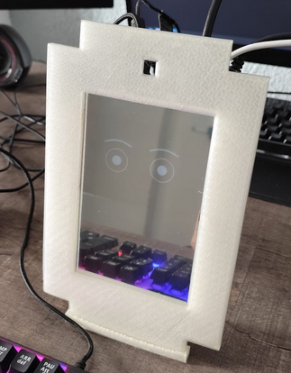

<div align="center">
  <a href="README.md" target="_blank">
    
  </a>
</div>


# AICompagnon

<div align="center">
  
</div>


## Project Objective

AICompagnon is an autonomous emotional conversational agent designed as a daily companion. It is intended for people who feel lonely, isolated, or lacking affection, and helps manage emotions.

**WARNING**: This is a conceptual prototype demonstrating technological progress. It will not perfectly meet all expectations.

> ℹ️ Currently available in French only  
> 📝 Project developed as part of a university internship  
> 🔖 Internship code version available in the [Releases](https://github.com/Juste-Leo2/AICompagnon/releases)

---

## Installation

### Hardware Requirements

- Storage: 32GB (recommended)  
- RAM: Minimum 8GB (16GB recommended)  
- Recent processor and graphics card

### Clone the Repository

```bash
git clone https://github.com/Juste-Leo2/AICompagnon.git
```

### Windows

1. Install [Python 3.11](https://www.python.org/downloads/release/python-3119/) (check "Add to PATH")  
2. Install [Vulkan SDK](https://vulkan.lunarg.com/sdk/home)  
3. Run in the project folder:

```bash
download.bat  
run_win.bat
```

### Linux (Radxa Rock 5B+)

Recommended OS: [Radxa OS](https://docs.radxa.com/en/rock5/rock5b/download)  
**Default password:** `radxa`

#### Enable SPI (if using ILI9488 display)

```bash
sudo rsetup
```

Navigate in the interface and enable SPI0 CS0.

```bash
sudo reboot
```

Pin configuration:

```bash
Power : 3.3V  
CLK   : GPIO 43  
MOSI  : GPIO 42  
MISO  : GPIO 41  
SS/CS : GPIO 44  
BL    : GPIO 105  
DC    : GPIO 106  
RST   : GPIO 107
```

▶️ [Radxa Rock 5B+ Documentation](https://docs.radxa.com/en/rock5/rock5b/hardware-design/hardware-interface?versions=ROCK+5B%2B)

#### Run

```bash
chmod +x download.sh run_linux.sh
./download.sh  
./run_linux.sh
```

---

## Hardware

- [Hardware specifications](docs/material/materiel.md)  
- [3D files (STL)](docs/stl)

---

## Acknowledgements

- Google team  
- My professional mentors  
- Developers of LM Studio  
- Creators of llama.cpp Python
